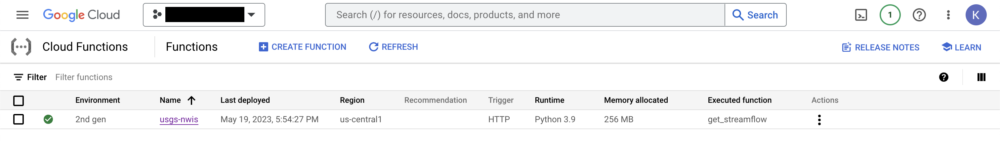
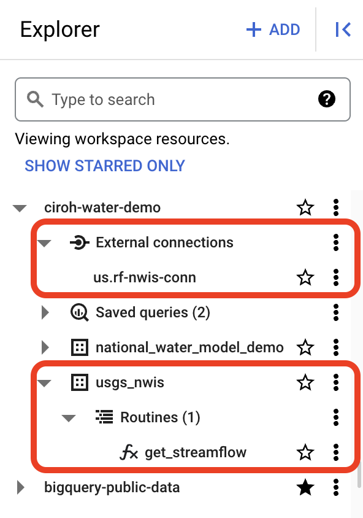
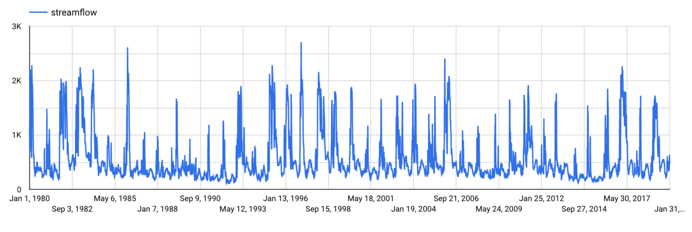

# bq-usgs-nwis-functions

This repository is for deploying cloud functions for to call [USGS National Water
Information System (NWIS)](https://waterdata.usgs.gov/nwis) service and load the
data into BigQuery tables for further analysis.

## Setup

If you do not already have a cloud project to deploy the functions to, you will 
need to create one. You can either do this through the 
[Cloud Console](https://console.cloud.google.com) or create on using 
[`gcloud`](https://cloud.google.com/sdk/gcloud/reference/projects/create). Once 
a project is created, the billing account will need to be linked to the project.

After the cloud project is ready, update the parameters in `config.sh` to the 
information for your setup.

## Deploy

With the setup complete, to deploy the functions and setup BigQuery run the 
following command:

```
bash deploy.sh
```

After executing the deploy command and everything completed successfully, you 
should see an active cloud funtion and the external connection plus table with 
routine in BigQuery.





## Run a Big Query job to get streamflow data

After everything is running, you can run a query to request streamflow timeseries
from a USGS site using the following example query:

```
SELECT
  time,
  '11425500' as site,
  usgs_nwis.get_streamflow('11425500', time) as streamflow
FROM
  UNNEST( 
    GENERATE_DATE_ARRAY(DATE('1980-01-01'), DATE('2020-02-01'), INTERVAL 1 DAY) 
  ) AS time
```

If you plot the results, you should be able to see the following results:



## Acknowledgements

This repo was inspired by the great demo found here: 
https://github.com/dojowahi/earth-engine-on-bigquery. A fair amount of code was
reused from the repo.